# Lab5web
Nama: Den Fahmi Satria <p>
Nim: 312410523 <p>
Kelas: TI.24.A5 <p>
Mata Kuliah: Pemrograman Web  <p>
Dosen Pengampu: Agung Nugroho, S.Kom., M.Kom <p> 
Universitas: Pelita Bangsa  <p>
### Praktikum 5: Javascript Dasar
Berikut adalah ringkasan, contoh kode, serta **hasil dan penjelasan** dari setiap langkah praktikum: <p>
### 1. Dasar: `document.write` dan `console.log` (`lab5_javascript.html`)
##### Contoh dasar penulisan kode JavaScript di dalam tag `<body>` .

```
html
<!DOCTYPE html>
<html lang="en">
<body>
    <h1>Pengenalan JavaScript</h1>
    <h3>Contoh document.write dan console.log</h3>
    <script>
        document.write("Hello World"); 
        console.log("Hello World");    
    </script>
</body>
</html>
```
Tampilan di Web dan VSCODE <p>
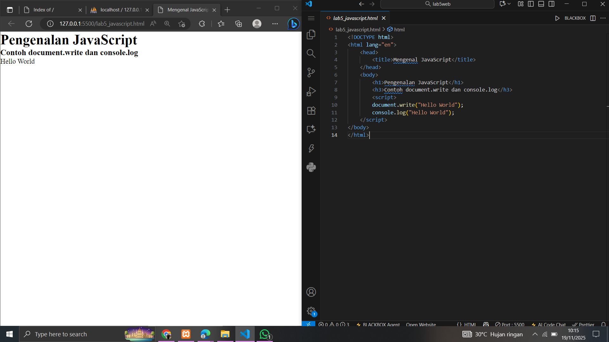
Hasil : Teks "Hello World" muncul di halaman web dan di Console browser . <p>
### 2. Penggunaan `window.alert` (`alert_box.html`)
Membuat kotak peringatan (alert box) saat halaman dimuat <p>

```
html
<html>
<body>
    <script language="javascript">
        window.alert("ini merupakan pesan untuk anda"); // Pesan peringatan 
    </script>
</body>
</html>
```
Tampilan di Web dan VSCODE <p>
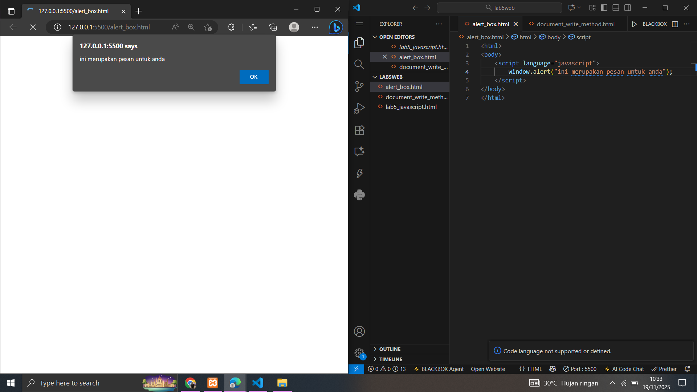
Hasil: Sebuah kotak dialog peringatan (alert box) muncul dengan pesan "ini merupakan pesan untuk anda". <p>
###  3. Pemakaian `document.write Method (`document_write_method.html`)
Contoh penggunaan `document.write` untuk menampilkan beberapa baris teks. <p>

```
html
<html>
<body>
    percobaan memakai javascript:<br>
    <script language="javascript">
        document.write("selamat mencoba javascript<br>"); 
        document.write("semoga sukses!"); 
    </script>
</body> 
</html>
```
Tampilan di Web dan VSCODE <p>
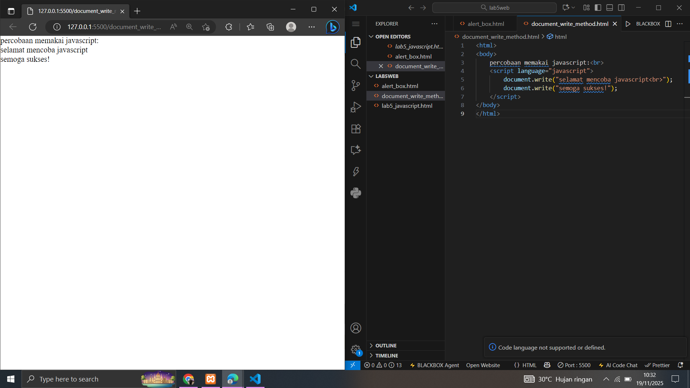
Hasil: <p> 
Halaman akan menampilkan: <p>
```
percobaan memakai javascript:
selamat mencoba javascript
semoga sukses!
```
### 4. Pemakaian `prompt` (`prompt_example.html`)
Menggunakan fungsi `prompt` untuk mendapatkan input dari pengguna. <p>
```
html
<html>
<body>
    <script language="javascript">
        var nama = prompt("siapa nama anda?", "masukkan nama anda"); 
        document.write("hai, " + nama); 
    </script>
</body>
</html>
```
Tampilan di Web dan VSCODE <p>
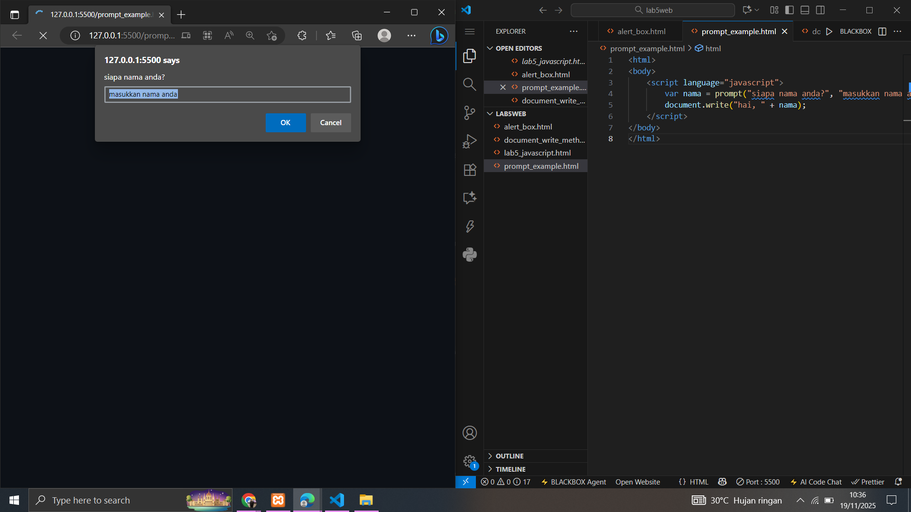 <p>
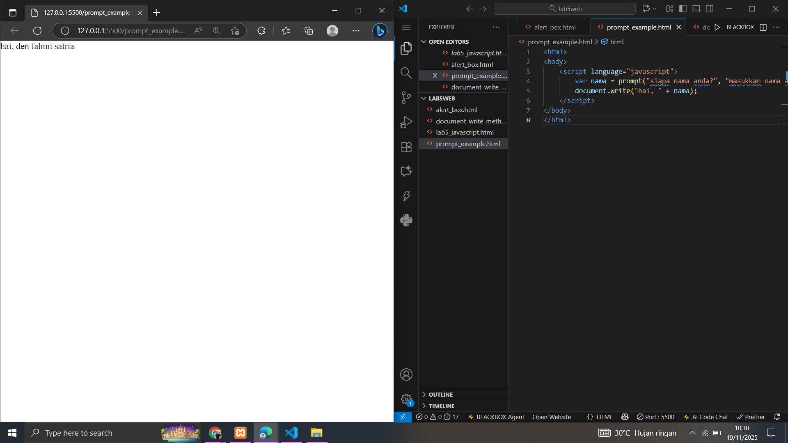 <p>
Hasil :  Muncul prompt box. Jika nama diisi "ridho", halaman menampilkan "hai, Den Fahmi Satria". <p>
Penjelasan Hasil: Fungsi `prompt()` meminta input teks dari pengguna dan menyimpannya dalam variabel `nama`. <p>
### 5. Pembuatan Fungsi dan Pemanggilan dengan `onload` (`function_onload.html`)
Membuat fungsi JavaScript dan memanggilnya saat `<body>` selesai dimuat. <p>
```
html
<html>
<head>
    <title>contoh program javascript</title>
    <script language="javascript">
        function pesan(){
            alert ("memanggil javascript lewat body onload") 
        }
    </script>
</head>
<body onload="pesan()"> </body>
</html>
```
Tampilan di Web dan VSCODE <p>
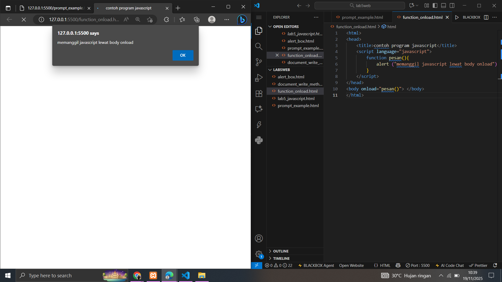 <p>
Hasil:  Setelah halaman dimuat, alert box otomatis muncul dengan pesan "memanggil javascript lewat body onload". <p>

Penjelasan Hasil: Atribut `onload` pada `<body>` adalah event handler yang mengeksekusi fungsi `pesan()` setelah semua elemen halaman selesai dimuat. <p>
### 6. Operasi Dasar Aritmatika (`arithmetic_operations.html`)
Contoh implementasi operasi aritmatika dasar secara langsung. <p>
```
html
<!DOCTYPE html>
<html lang="en">
<head>
    <title>Operasi Aritmatika</title>
</head>
<body>
    <script>
        var a = 10;
        var b = 5;
        
        var c = a + b; 
        document.write("Hasil Penjumlahan: " + c + "<br>");
        
        c = a - b; 
        document.write("Hasil Pengurangan: " + c + "<br>");
        
        c = a * b;
        document.write("Hasil Perkalian: " + c + "<br>");
        
        c = a / b;
        document.write("Hasil Pembagian: " + c + "<br>");
    </script>
</body>
</html>
```
Tampilan di Web dan VSCODE <p>
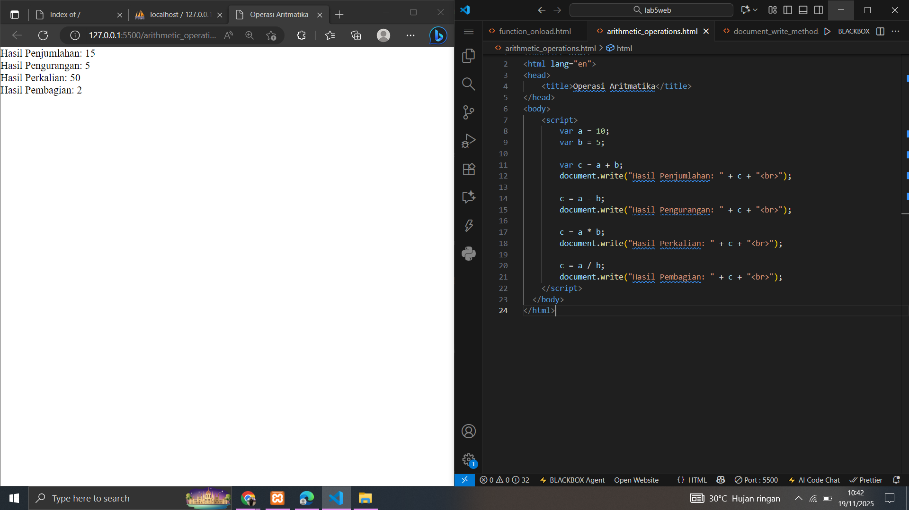 <p>
Hasil:  Halaman akan menampilkan: <p>
```
Hasil Penjumlahan: 15
Hasil Pengurangan: 5
Hasil Perkalian: 50
Hasil Pembagian: 2
```
Penjelasan Hasil: Variabel `a` (10) dan `b` (5) digunakan untuk melakukan operasi Penjumlahan (`+`), Pengurangan (`-`), Perkalian (`*`), dan Pembagian (`/`), dengan hasilnya dicetak menggunakan `document.write()`. <p>
### 7. Seleksi Kondisi `if..else` (`if_else_selection.html`)
Contoh seleksi kondisi untuk menentukan kelulusan berdasarkan nilai input. <p>
```html
<html>
<body>
    <script language="javascript">
        var nilai = prompt("nilai (0-100): ", 0); 
        var hasil = "";
        if (nilai >= 60) { 
            hasil = "lulus"; 
        } else { 
            hasil = "tidak lulus"; 
        }
        document.write("hasil: " + hasil);
    </script>
</body>
</html>
```
Tampilan di Web dan VSCODE <p>
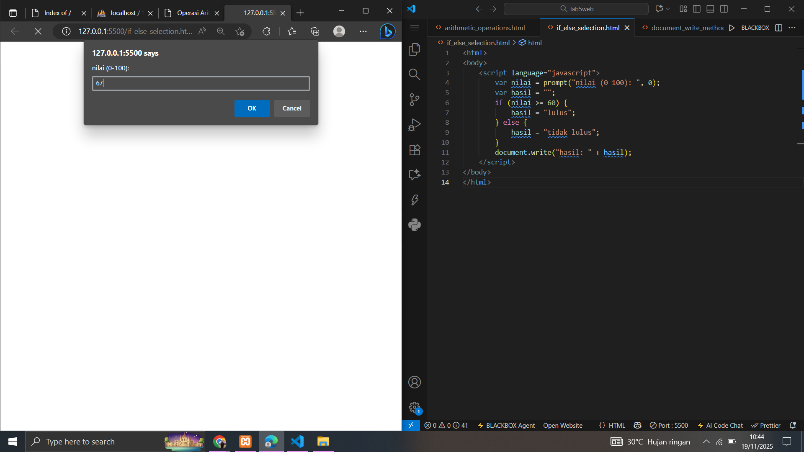 <p>
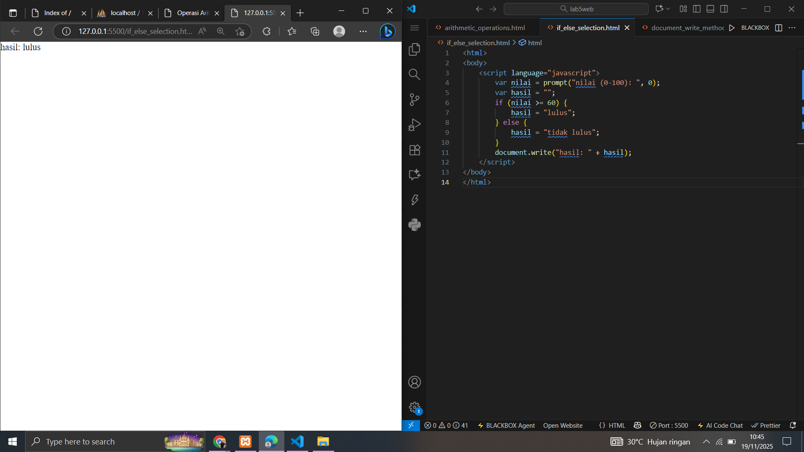 <p>
Hasil: Jika Input 67, hasil "lulus". Jika Input di bawah 60, hasil "tidak lulus". <p>
Penjelasan Hasil: Pernyataan `if (nilai >= 60)` mengecek kondisi. Jika benar, variabel `hasil` diisi "lulus"; jika salah (blok `else`), diisi "tidak lulus". <p>
### 8. Seleksi Kondisi `switch` (`switch_selection.html`)
Contoh penggunaan operator `switch` untuk seleksi kondisi pada beberapa nilai. <p>
```
html
<script language="javascript">
    function test () {
        val1 = window.prompt("input nilai (1-5):")
        switch (val1) {
            case "1":
                document.write("bilangan satu"); break
            // ... cases 2, 3, 4, 5 ...
            default:
                document.write("bilangan lainnya");
        }
    }
</script>
<body>
    <input type="button" name="button" value="switch" onclick="test()">
</body>
```
Tampilan di Web dan VSCODE <p>
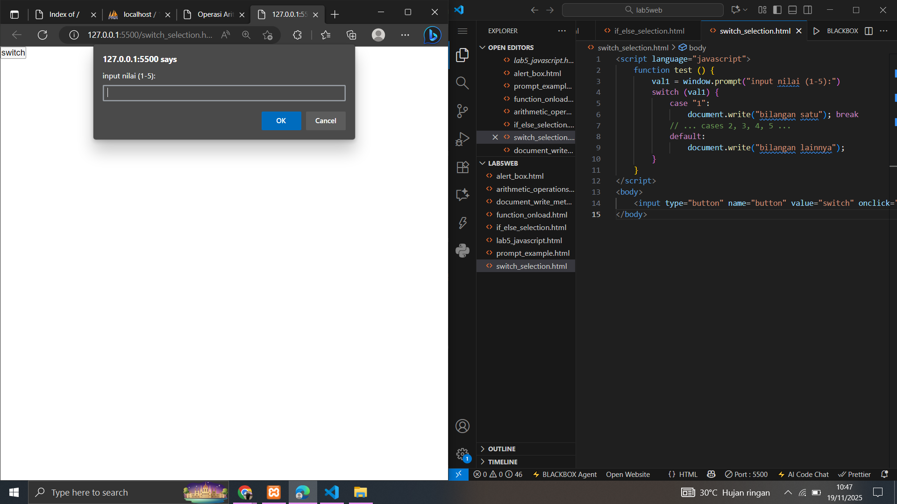 <p>
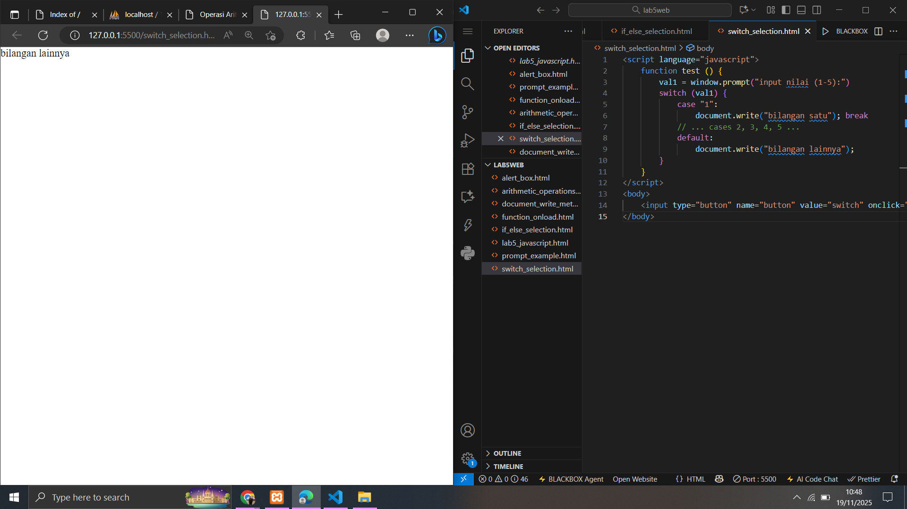 <p>
### 9. Form Input: Cek Ganjil/Genap (form_input_tebak_bil.html)
Manipulasi form: mengambil input, memproses, dan menampilkan hasil di form yang sama. <p>
```html
<script language="javascript">
  function test() {
    var val1 = document.kirim.T1.value;

    var num = parseInt(val1);

    if (isNaN(num)) {
      document.kirim.T2.value = "Input harus berupa angka!";
      return;
    }

    if (num % 2 == 0) {
      document.kirim.T2.value = "bilangan genap";
    } else {
      document.kirim.T2.value = "bilangan ganjil";
    }
  }
</script>
<body>
   
  <form method="POST" name="kirim">
       
    <p>
      BIL <input type="text" name="T1" size="20" />     MERUPAKAN BIL
      <input type="text" name="T2" size="20" />
    </p>
       
    <p><input type="button" value="TEBAK" name="B1" onclick="test()" /></p>
     
  </form>
</body>
```
Tampilan di Web dan VSCODE <p>
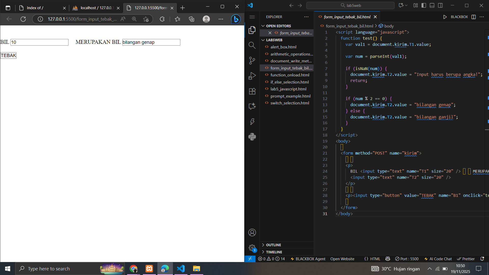 <p>
Penjelasan: <p>
Fungsi test() bertugas mengonversi teks input (T1) menjadi angka (parseInt). <p>
Validasi: Kode pertama-tama mengecek apakah hasil konversi adalah angka yang valid (isNaN). Jika tidak valid, fungsi akan menampilkan error dan berhenti (return). <p>
Logika: Jika valid, ia menggunakan operator modulus (% 2) untuk menentukan sisa bagi. <p>
Output: Jika sisa bagi 0, field T2 diisi "bilangan genap"; jika tidak, diisi "bilangan ganjil". <p>
### 10. Form Button: Ubah Warna Dokumen (`form_button_color.html`)
Mengubah warna latar belakang dan teks dokumen menggunakan properti objek `document`. <p>
```
html
<script language="javascript">
  function ubahwarnaLB(warna) {
    document.bgColor = warna;
  }
  function ubahwarnaLD(warna) {
    // <--- DEFINISI FUNGSI
    document.fgColor = warna; // <--- PASTIKAN BARIS INI ADA
  }
</script>
<body>
  <h1>tes</h1>

  <form>
    <input
      type="button"
      value="Latar Belakang Hijau"
      onclick="ubahwarnaLB('GREEN')"
    />

    <input type="button" value="Teks Biru" onclick="ubahwarnaLD('BLUE')" />  
  </form>
</body>
```
Tampilan di Web dan VSCODE <p>
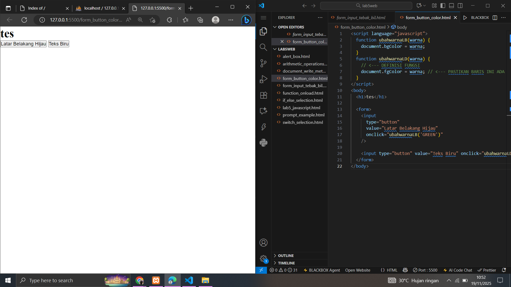 <p>
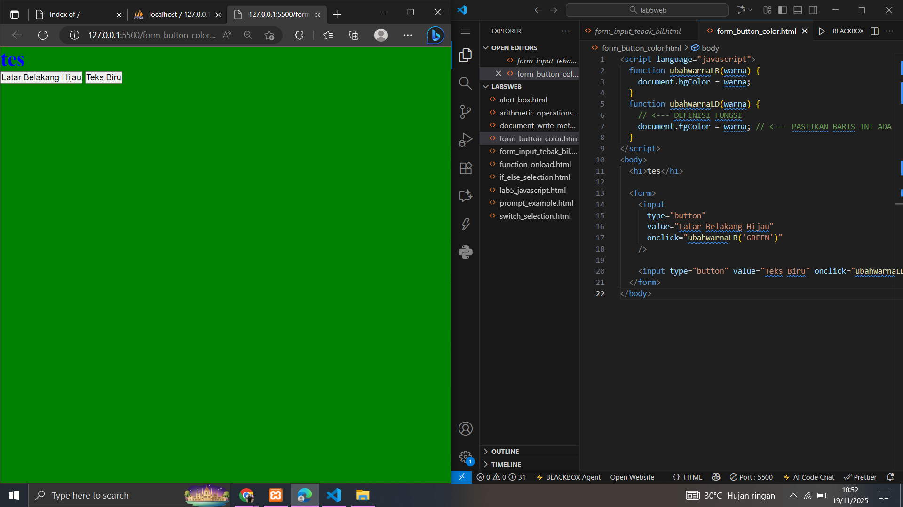 <p>
penjelasan:

Kode ini mendefinisikan dua fungsi untuk memanipulasi properti tampilan dokumen: <p>
ubahwarnaLB(warna): Mengatur warna latar belakang halaman melalui properti document.bgColor. <p>
ubahwarnaLD(warna): Mengatur warna teks di halaman melalui properti document.fgColor. <p>
Fungsi-fungsi ini dipanggil oleh tombol yang sesuai di HTML melalui event onclick dengan meneruskan nama warna (misalnya, 'GREEN' atau 'BLUE'). <p>
### 11. Jawaban Tugas: Validasi Form (`form_validation.html`)
Implementasi skrip validasi sederhana untuk memastikan field tidak kosong dan format email dasar valid. <p>
```
html
<form name="formValid" onsubmit="return validasi()">
Nama: <input type="text" name="nama"><br>
Email: <input type="text" name="email"><br>
<input type="submit" value="Kirim">
</form>

<script>
function validasi() {
    let nama = document.forms["formValid"]["nama"].value;
    let email = document.forms["formValid"]["email"].value;
    if (nama == "" || email == "") {
        alert("Nama dan Email wajib diisi!");
        return false;
    }
    alert("Data berhasil dikirim!");
    return true;
}
</script>
```
Tampilan di Web dan VSCODE <p>
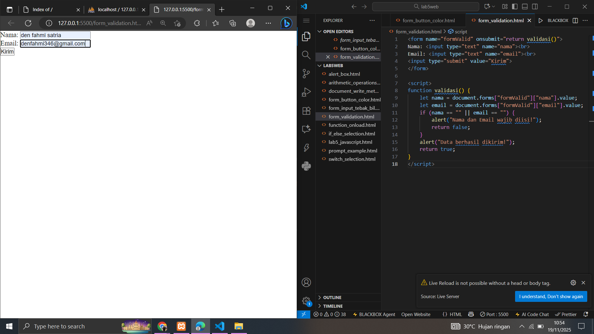 <p>
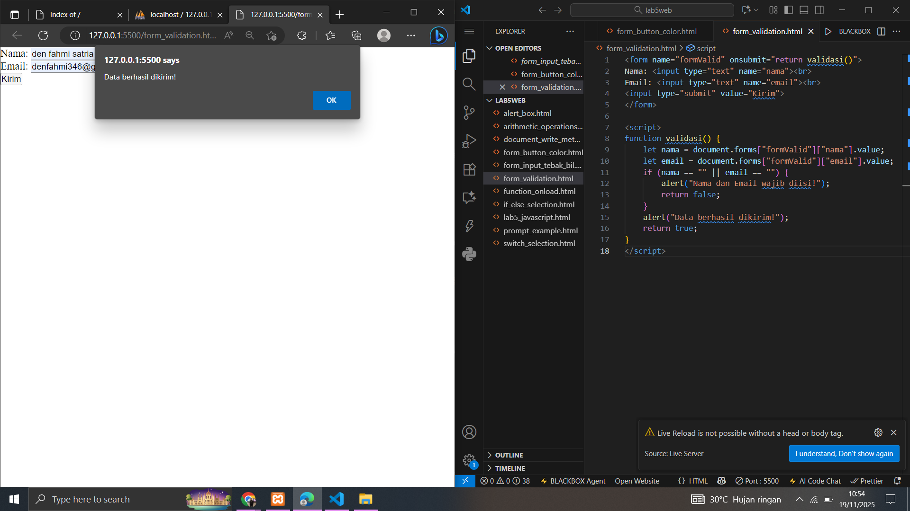 <p>
Hasil: Jika Nama kosong, proses submit dibatalkan dan muncul alert "Nama harus diisi.". <p>
Penjelasan Hasil: Fungsi validasi() bekerja saat tombol Kirim pada formulir diklik (karena ada onsubmit="return validasi()"). <p>
Pengambilan Data: Kode mengambil nilai yang diisi pada field Nama dan Email . <p>
Pengecekan: Kode memeriksa apakah nama ATAU (||) email kosong (""). <p>
Kasus Gagal: Jika salah satu atau kedua field kosong, kode menampilkan alert "Nama dan Email wajib diisi!" dan mengembalikan return false. <p>
Hasil: Nilai false ini akan menghentikan proses pengiriman formulir. <p>
Kasus Berhasil: Jika kedua field terisi, kode menampilkan alert "Data berhasil dikirim!" dan mengembalikan return true. <p>
Hasil: Nilai true ini akan melanjutkan proses pengiriman formulir ke server <p>
### 12. HTML DOM: Perhitungan Otomatis CheckBox (daftar_menu.html)
HTML DOM (Document Object Model) untuk melakukan perhitungan otomatis dari total harga menu yang dipilih menggunakan checkbox. <p>
```html
<html>
<head>
    <title>Daftar Menu</title>
    <script>
        function hitung(ele) {
            
            var total = document.getElementById('total').value;
            total = (total ? parseInt(total) : 0); 

            var harga = parseInt(ele.value);

            if (ele.checked) {
                
                total = total + harga;
            } else {
               
                total = total - harga;
            }
            document.getElementById('total').value = total;
        }
    </script>
</head>
<body>
    <h1>Daftar Menu Makanan</h1>
    
    <label><input type="checkbox" value="3000" onclick="hitung(this)" /> Ayam Goreng Rp. 5.000</label><br />
    
    <label><input type="checkbox" value="500" onclick="hitung(this)" /> Tempe Goreng Rp. 500</label><br />
    
    <label><input type="checkbox" value="2500" onclick="hitung(this)" /> Telur Dadar Rp. 2.500</label><hr />
    
    <strong>Total Bayar Rp. <input id="total" type="text" readonly /></strong>
</body>
</html>
```
Tampilan di Web dan VSCODE <p>
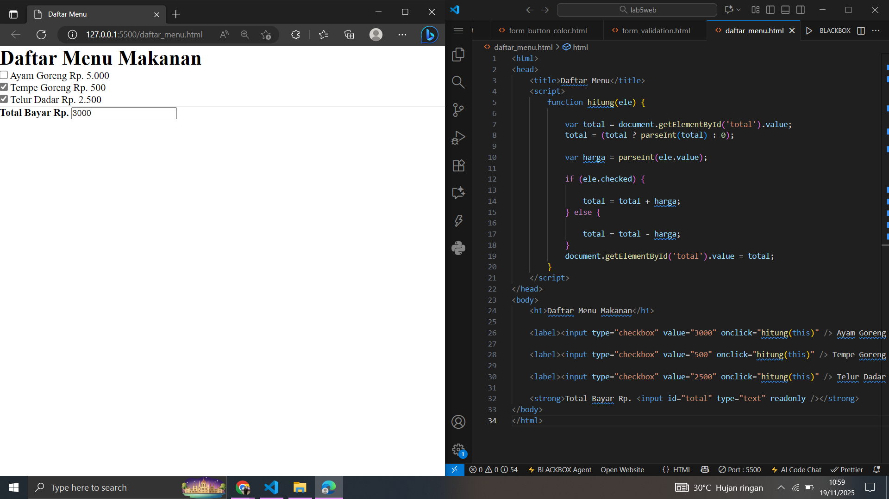 <p>
Hasil: <p>
Awalnya, kotak input Total Bayar kosong (atau 0).
Pengguna mencentang Ayam Goreng (value 3000): Total menjadi 3000.
Pengguna mencentang Tempe Goreng (value 500): Total menjadi 3500.
Pengguna melepaskan centang pada Ayam Goreng: Total kembali menjadi 500.
Penjelasan Hasil:
Fungsi hitung(ele) dipicu oleh event onclick pada setiap checkbox, dan this dilewatkan sebagai argumen (ele), merujuk pada elemen checkbox itu sendiri.
Pengambilan Nilai: Fungsi mengambil total harga saat ini dari input teks dengan document.getElementById('total').value.
Logika:
Jika ele.checked (dicentang), nilai numerik dari checkbox (ele.value) ditambahkan ke total.
Jika tidak dicentang (dilepas), nilai numerik dikurangi dari total.
Output: Nilai total yang baru kemudian diperbarui ke dalam field input total. Ini adalah contoh klasik DOM manipulation di mana JavaScript membaca dan menulis nilai ke elemen-elemen HTML. <p>
